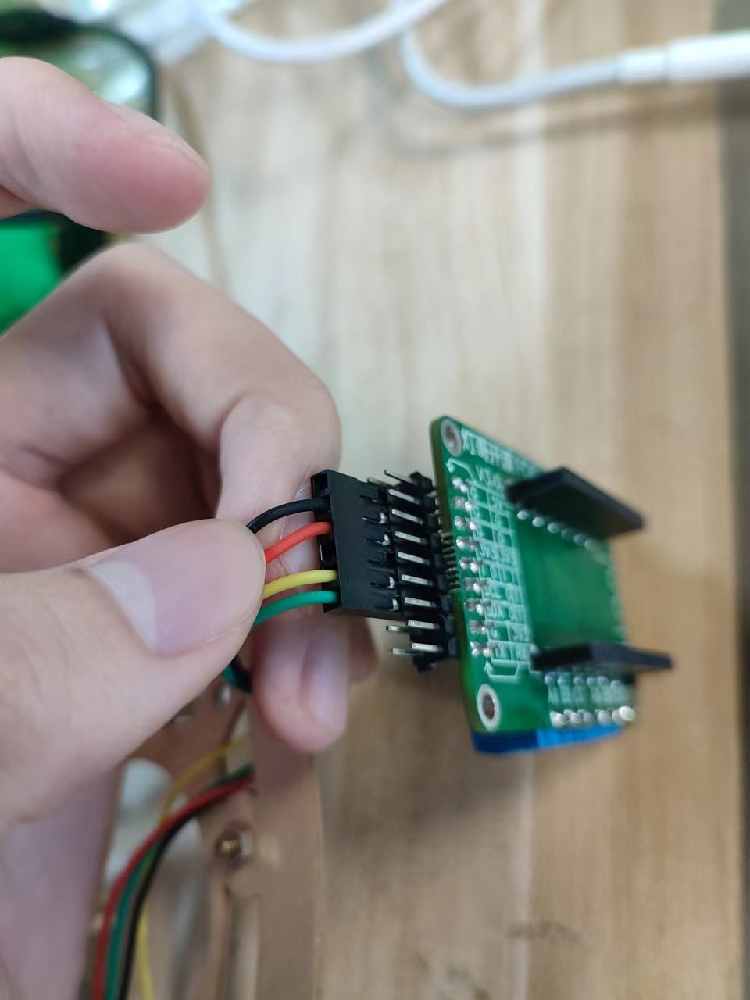

# DengFOC莱洛LQR自平衡三角形项目
**DengFOC莱洛LQR自平衡三角形**是基于45同学开源的[莱洛三角形项目](https://gitee.com/coll45/foc)，进行结构改进和效果优化后应用在我开源的[DengFOC](https://github.com/ToanTech/Deng-s-foc-controller)双路无刷电机驱动器上的DengFOC配套项目。

**项目完全开源，你可以根据本Github内容自行白嫖，或者，支持一下灯哥的辛勤劳作，进入灯哥开源TB店购买DengFOC莱洛自平衡三角形套件，一键配齐。**

[DengFOC动莱洛自平衡三角形套件--链接猛击(进店后在 所有宝贝 处可找到)](https://shop564514875.taobao.com/)

## 1 视频教程

配套本开源项目，灯哥精心制作了全组装过程视频教程和算法原理课，请点击查看：

[1 DengFOC LQR莱洛三角形--效果展示](https://www.bilibili.com/video/BV1Mg411o7hd/)

[2  DengFOC LQR莱洛三角形算法原理和DIY实现](https://www.bilibili.com/video/BV1QG4y1Y76f/)

## 2 接线

只要你手头有一块DengFOC V3（你可以在TB搜索**灯哥开源**进入店铺购买，或根据[DengFOC开源仓库](https://github.com/ToanTech/Deng-s-foc-controller)的开源资料自制）就可以快速搭接出此项目，项目供电默认电压为12V(3S航模电池)，除DengFOC外，其它电子元器件主要由一个2204无刷电机，两个 AS5600 编码器，一个 MPU6050 组成。其接线表格如下,其中，接线位置指的是DengFOC无刷驱动板上的针脚位置：

| 零件     | 接线位置                    |
| -------- | --------------------------- |
| 2204电机 | DengFOC M0位置（无刷电机0） |
| AS5600   | SDA0,SCL0,3V3,GND           |
| MPU6050  | SDA1,SCL1,3V3,GND           |

如果你是自行DIY，那么按照上面的接线表格将线接入DengFOC即可；如果你是采用在 [灯哥开源 淘宝店](https://shop564514875.taobao.com/) 购买的莱洛三角形套件，那么你会得到**如下图所示配套线材**。

配套的接线材料有：两套接线，一套是AS5600的线，一头是杜邦端子，接有两根黑线GND，一根红线VCC，一根绿线SDA，一根黄线SCL；另一端是两个3p端子，其中一个3p端子接绿色SDA，黄色SCL，黑色DIR；另一个是接红色VCC，黑色GND，如下图中左边的线所示。

另一套是MPU6050的线，一头是杜邦端子，接有一根黑线GND，一根红线VCC，一根黄线SCL，一根绿线SDA；另一端接一个4p端子），如下图中右边的线：

### 2.1 对于 AS5600

首先，将上图左边的线按照下图所示穿过三角块和底板打印件：

接着，将线的其中一个3p端子接GND、SCL和SDA线，其中GND为黑色线，SCL为黄色线，SDA为绿色线；另一个只连着两条线的端子用来接VCC和GND，VCC为红色线，GND为黑色线。接线位置如下图所示：

最后，将杜邦线的另一端按照下图的顺序接在DengFOC的杜邦端口上：

这就是AS5600的接线过程。

### 2.2 对于MPU6050

首先，将MPU6050的四根线穿过三角块和底板打印件，如下图所示：

将4P端子按下图的顺序接SDA，SCL，GND,VCC线，SDA为绿色线， SCL为黄色线，GND为黑色线，VCC为红色线

再将杜邦线的另一端按照下图的顺序接在杜邦端口：

这就是MPU6050的接线步骤

### 2.3 对于电机

直接接到电机M0接口（无刷电机0）接口即可，若接入后，在调试过程中发现动量轮不能减小误差，反而会加剧误差的话，证明电机转向接反，此时对调电机其中两根相线即可。

## 3 零件制造

莱洛三角形的由两种DIY方式，一个是**3D打印版本**；一个是**激光切割的木材板版本**

**对于3D打印版本**：主要零件为3D打印，下载文件夹中的图纸，全100%密度打印即可。

**对于激光切割的木材版版本**：底板为激光切割，固定三角型为3D打印，下载文件夹中的图纸，对应进行切割和打印即可。

零件打印图纸和木材板切割图纸都可以在本项目的开源文件夹中找到。

## 4 下载程序

下载项目文件夹中的 lailuo.ino 程序，用Arduino IDE打开，用串口连接DengFOC，即可按照与一般Arduino一致的方法上传。

## 5 调试

在安装好机械结构后，本莱洛三角形的调试可以采用45同学开发的调试工具进行调试，调试步骤如下：

打开 **调试上位机** 中自带的可执行文件_main文件夹，点击main.exe文件进入交互界面:

进入之后的界面如下：

要使用这个调试软件，首先要先将莱洛三角形上电，然后在WiFi列表中找到**esp32_lailuo**这个WiFi，并连接（WiFi密码可以在源程序中找到）。

已经连接WiFi之后点击设置键，就可以开始调试了。

点击设置按键后，软件自动与DengFOC通讯，得到界面如下：

其中：

**Start**：可以在可视化图表显示各个参数的波形。

**Disable**：按下后会变成Enable，是用来打开或者关闭电机的按钮，这个在调参时可以用于开启和关闭电机，防止电机在不需要的时候乱动。

**View all**：如果你放大了波形图然后想让波形图的大小恢复原样，就可以点击这个按钮。

在调试时，我们先点击 **Start** 按键，使得软件将点击的参数显示出来，接着，点击**Disable**先禁止电机，防止电机乱动影响调试观测。在完成这一步后，下图便是调试时需要操作主要界面部分：

期望角度就是他设置的平衡时的角度，在调试时，我们需要将莱洛三角形扶起，使它保持垂直于桌面，如下图所示：

如上图，黄色波形所显示的就是莱洛三角形当前储存的期望角度，橙色的波形就是目前所在的角度，将软件中的**期望角度**设置为橙色的角度后，就完成了莱洛三角形的角度标定。

摇摆电压控制的是莱洛三角形左右摇摆的电压，电压越大就能经过越少次摆动到达平衡，但是摇摆电压过大会翻跟头。

摇摆角度是离平衡状态还差多少度时，切换到自平衡控制。

理论上，你只需要设置好**期望角度**，即可正常使用该莱洛三角形，其它的参数如摇摆电压，摇摆角度等，在程序中已经预设了我们调到的最佳参数值，除非更改机械结构或特殊情况，否则无需设置。

完成设置好**期望角度**之后，电机电机的状态按钮，使其由**Disable**变为**Ensable**，此时电机开始转动，在你设置的期望角度处将为自动自平衡稳当当的立住。

如果此时将莱洛三角形推倒，莱洛三角形将会摇晃，并努力使得自己回到能够自稳定的位置，当到达能自稳定的位置后，三角形将重新自平衡立住。

## 6 其它注意事项

如果更换为其他电机，需要重新设置电机极对数

如果自稳效果与倾倒方向相反，证明电机三相线接反，导致电机转向接反，调换三相线中其中两根即可

## 7 致谢

感谢 45 同学开源的[莱洛三角形项目](https://gitee.com/coll45/foc)，也感谢他在我将莱洛三角形项目应用在 DengFOC 过程中所给予的支持。

